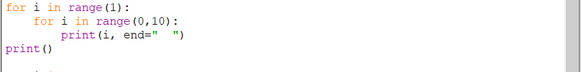
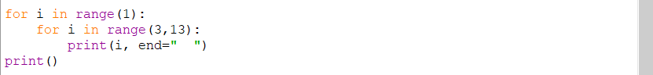
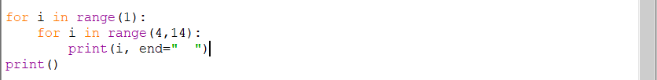
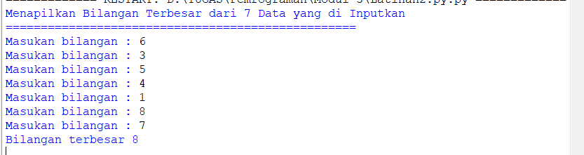
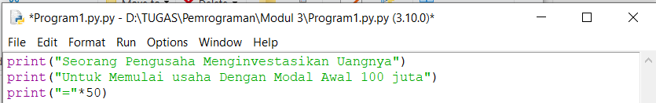

# Praktikum-Ke-3

# Tugas Latihan 1
# Menentukan Bilangan Terbesar dari 2 buah Bilangan

1. Langkah pertama kita buka dulu aplikasi python, lalu klik new project.
2. Selanjutnya kita buat dulu perintah untuk menampilkan judul programnya. seperti berikut :

3. Lalu kita mulai ke pembuatan programnya. disini kita buat program untuk memasukan bilangan. type data yang kita gunakan yaitu integer karna bilangan yang kita masukan adalah bilangan real. berikut contoh programnya :

4. Kita gunakan perintah if dan else untuk mencari bilangan terbesarnya. Seperti contoh berikut :

5. Setelah itu kita print untuk menampilkan hasil programnya.

6. Berikut adalah Hasil nya. Disini saya menginput bilangan A=64 dan B=59. Berikut hasil programnya:

7. Hasilnya adalah Bilangan A adalah bilangan terbesar.
8. Ini adalah flowchart dari program tersebut.

# Tugas Latihan 2
# Program Mengurutkan Bilangan Terkecil sampai Terbesar

1. Langkah pertama kita buat judul program terlebih dahulu.

2. Selanjutnya ketikan perintah untuk memasukan bilangan yang akan ditampilkan. disini saya menggunakan perulangan for. contohnya sebagai beriku: 

3. Lalu kita ketikan perintah untuk mengurutkan data/bilangan yaitu list.sort(). berikut contohnya :

4. Setelah itu tekan F5 untuk cetak programnya.
5. Disini kita disuruh memasukan bilangan. contohnya sebagai berikut:

6. Program telah selesai.
7. Ini adalah flowchart dari program tersebut.

# Tugas Latihan Perulangan 1
# Program Perulangan Bertingkat (Nested)

1. Pertama Buat perintah untuk menampilkan judul p
perulangan pertama kita mengurutkan angka 0-9. contohnya sebagai berikut :rogram.

2. Disini kita akan menggunakan perulangan for untuk menampilkan 10 angka secara berurutan. untuk perulangan pertama kita mengurutkan angka 0-9. contohnya sebagai berikut :

3. perulangan kedua kita mengurutkan angka 1-10. contohnya sebagai berikut :

4. perulangan ketiga kita mengurutkan angka 2-11. contohnya sebagai berikut :

5. perulangan keempat kita mengurutkan angka 3-12. contohnya sebagai berikut :

6. perulangan lima kita mengurutkan angka 4-13. contohnya sebagai berikut :

7. perulangan enam kita mengurutkan angka 5-14. contohnya sebagai berikut :

8. perulangan tujuh kita mengurutkan angka 6-15. contohnya sebagai berikut : 

9. perulangan kedelapam kita mengurutkan angka 7-16. contohnya sebagai berikut :

10. perulangan sembilan kita mengurutkan angka 8-17. contohnya sebagai berikut :

11. perulangan sepuluh kita mengurutkan angka 9-18 . contohnya sebagai berikut :
![Gambar]modul1/LatPerulangan1/per11.png)
12. Berikut hasil programnya. 

13. Ini adalah flowchart dari program tersebut.

# Tugas Latihan Perulangan 2
# Menampilkan 5 buah Bilangan acak yang lebih kecil dari 0.5

1. Pertama kita perintah untuk menampilkan judul program.

2. Selanjutnya agar bisa menampilkan bilangan acak kita menggunakan perintah import random, kita menggunakan while dan break untuk menghentikan perulangan. contohnya seperti berikut :

3. Proses berikutnya kita menggunakan perintah for untuk menampilkan perulangan dari bilangan acak tersebut. contohnya seperti berikut :

4. Langkah terakhir kita tekan F5 untuk cetak programnya.
5. Berikut Hasil dari programnya, disini saya memasukan 5 bilangan acak. 

6. Ini adalah flowchart dari program tersebut.

# Tugas Praktikum 2
# Menampilkan Bilangan Terbesar dari 3 buah bilangan yang diinputkan

1. Seperti biasa kita buat judul prgram terlebih dahulu.

2. Lalu kita beri deklarasi untuk menginputkan bilangan A,B, dan C. Contoh seperti berikut :

3. Disini kita menggunakan perintah if else. Pertama kita mencari bilangan terbesar antara Adan B. untuk maks(bilangan yang yang akan dicetak) jadi ketika ada salah satu bilangan terbesar dari ketiga bilangan tersebut akan ditampilkan oleh maks. berikut contoh programnya :

4. Selanjutnya buat perintah Mencari bilangan terbesar antara C dan maks. Contoh :

5. Lalu tekan F5 untuk menjalankan program. Berikut hasilnya :

6. Ini adalah flowchart dari program tersebut.
![Gambar].(modul2/2.1.png)

# Tugas Latihan.py 1
# Menampilkan 5 buah Data Bilangan acak yang lebih kecil dari 0.5

1. Pertama kita perintah untuk menampilkan judul program.

2. Selanjutnya agar bisa menampilkan bilangan acak kita menggunakan perintah import random, kita menggunakan while dan break untuk menghentikan perulangan. contohnya seperti berikut :

3. Proses berikutnya kita menggunakan perintah for untuk menampilkan perulangan dari bilangan acak tersebut, lalu ketikan juga perintah untuk mencetak data . contohnya seperti berikut :

4. Langkah terakhir kita tekan F5 untuk cetak programnya.

5. Berikut Hasil dari programnya, disini saya memasukan 5 bilangan acak. 

6. Ini adalah flowchart dari program tersebut.

# Tugas latihan.py 2
# Menampilkan Bilangan Terbesar dari 7 buah bilangan yang diinputkan

1. Seperti biasa kita buat judul prgram terlebih dahulu.

2. Lalu kita beri deklarasi u ntuk menginputkan bilangan A - G. Contoh seperti berikut :

3. Sama seperti program sebelumnya. Disini kita menggunakan perintah if else. Pertama kita mencari bilangan terbesar antara Adan B. untuk maks(bilangan yang yang akan dicetak) jadi ketika ada salah satu bilangan terbesar dari ketiga bilangan tersebut akan ditampilkan oleh maks. berikut contoh programnya :

4. Selanjutnya buat perintah Mencari bilangan terbesar antara C-G dan maks. Contoh :

5. Lalu tekan F5 untuk menjalankan program. Berikut hasilnya :

6. Ini adalah flowchart dari program tersebut.

# Tugas Latihan.py.3
# Program Menghitung Total Keuntungan

1. Kita buat perintah untuk menampilkan Judulnya terlebih dahulu.

2. Lalu kita buat program untuk menginputkan Laba dari bulan ke 1 sampai ke 8. disini kita menggunakan type data float karena kita akan menggunakan bilangan desimal. setelah itu kita jumlahkan laba dari bulan ke 1 sampai ke 8. berikut programnya:

3. Lalu buat printah untuk menampilkan total laba.

4. Tekan F5 untuk menjalankan program. berikut hasil programnya :

5. Ini adalah flowchart dari program tersebut.
